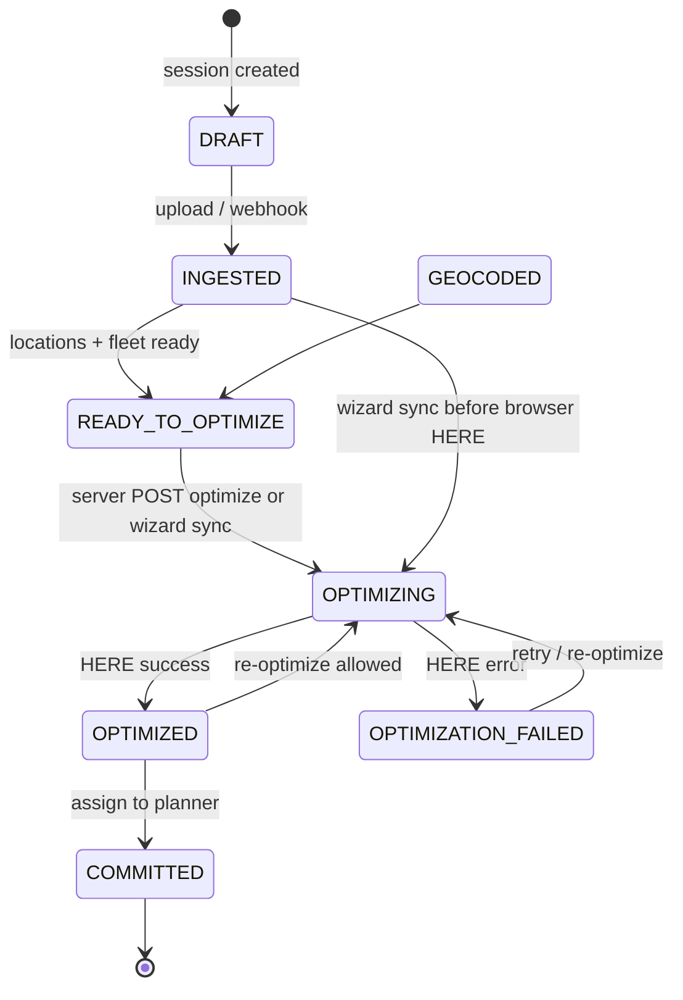

# Session lifecycle & status sync

Every Route Planning wizard run is stored as a **`route_planning_session`**. The **`status`** column drives session history, export/assign toolbar gates, and API guards.

Backend enforcement: **`RoutePlanningSessionTransitionValidator`** (Java). Frontend mirrors the same rules in **`routePlanningSessionStatusSync.js`** and **`routePlanningSessionActionGates.js`**.

---

## Status diagram



---

## Status reference

| Status | Meaning | Operator milestone |
| :--- | :--- | :--- |
| `DRAFT` | Empty session shell | — |
| `INGESTED` | Stops loaded from upload/webhook | File uploaded |
| `GEOCODED` | Geocoding pass complete | Locations confirmed |
| `READY_TO_OPTIMIZE` | Depot, fleet, stops ready | Fleet configured |
| `OPTIMIZING` | HERE job in progress | Optimizing routes… |
| `OPTIMIZED` | Routes available for export/assign/dispatch | Routes on map |
| `OPTIMIZATION_FAILED` | Last optimize failed | Error banner / retry |
| `COMMITTED` | Planner trips created | **Planned in TCMS** — view-only |

Invalid transitions via `PUT /sessions/{id}` return **`RP_SESSION_001`** (409).

---

## Who updates status when

| Wizard event | Mechanism |
| :--- | :--- |
| Upload / webhook ingest | Backend → **`INGESTED`** |
| Server `POST …/optimize` starts | Backend → **`OPTIMIZING`** |
| Server optimize succeeds | Backend → **`OPTIMIZED`** |
| Server optimize fails | Backend → **`OPTIMIZATION_FAILED`** |
| Browser HERE optimize starts | Wizard `PUT` → **`OPTIMIZING`** (if needed) |
| Browser HERE optimize succeeds | Wizard `PUT` → **`OPTIMIZED`** |
| Browser HERE optimize fails | Wizard `PUT` → **`OPTIMIZATION_FAILED`** |
| **Assign to planner** (server routes) | `POST …/commit-to-planner` → **`COMMITTED`** + commit log |
| **Assign to planner** (browser routes) | Legacy planner save succeeds → wizard `PUT` → **`COMMITTED`** |

### Wizard status sync implementation

File: `TCMSBookingWebApp/src/modules/routePlanning/utils/routePlanningSessionStatusSync.js`

- Reads current status via `GET /sessions/{id}` (or caller-provided status).
- Computes shortest allowed path (e.g. `INGESTED` → `OPTIMIZING` → `OPTIMIZED` → `COMMITTED`).
- Applies each step with `PUT /sessions/{id}` and `{ "status": "…" }`.

This keeps **Session history** accurate when operators use browser HERE (common in dev with `VITE_HERE_API_KEY`) or assign from browser-optimized routes without a prior server optimize.

---

## Assign to planner prerequisites

| Path | Requires |
| :--- | :--- |
| `POST …/commit-to-planner` | Session **`OPTIMIZED`**; routes persisted on server (`GET …/optimization-result` non-empty); valid truck/driver per route |
| Legacy planner save (wizard) | Browser assignment snapshot with routes; session id optional but required for **`COMMITTED`** sync |

After **`COMMITTED`**:

- UI disables **Assign to planner** on optimization and assignment review.
- Reopening the session loads routes from server optimization result or browser snapshot cache (addresses visible).
- Forced second server commit → **`RP_COMMIT_008`**.

---

## PUT session status (integrators)

Optional body field on `PUT /rest/route-planning/sessions/{sessionId}`:

```json
{
  "status": "OPTIMIZED"
}
```

Only **allowed transitions** from the current status succeed. Example chain from ingest to committed:

1. `{ "status": "OPTIMIZING" }` (from `INGESTED`)
2. `{ "status": "OPTIMIZED" }`
3. `{ "status": "COMMITTED" }` (after planner trips exist)

Direct API callers must chain steps; the wizard does this automatically.

---

## Toolbar gates (frontend)

From `routePlanningSessionActionGates.js`:

| Gate | Enabled when |
| :--- | :--- |
| Export route/load plan | `OPTIMIZED` or `COMMITTED` + routes exist |
| Assign to planner | `OPTIMIZED` + routes exist; **disabled** when `COMMITTED` |
| Send to third party | `OPTIMIZED` or `COMMITTED` + routes exist |
| Retry optimization | `OPTIMIZATION_FAILED` |

---

## Live route tracking visibility

Sessions with status **`OPTIMIZED`**, **`COMMITTED`**, or **`EXPORTED`** appear on **Live Route Tracking** for their planning date (`GET /live-routes`). **`COMMITTED`** sessions typically have planner trips and mobile GPS; **`OPTIMIZED`** sessions show planned geometry but may show **no signal** until assign completes.

See [Live route tracking API](./live-route-tracking-api) and [Live route tracking (operators)](/docs/route-planning/live-route-tracking).

---

## Related

- [Live route tracking API](./live-route-tracking-api)
- [Error codes — session & commit](./error-codes#session)
- [End-to-end flow (operators)](/docs/route-planning/end-to-end-flow)
- TCMS repo: `docs/developer/route-planning/ROUTE_PLANNING_V2_WORKFLOW.md` §5
