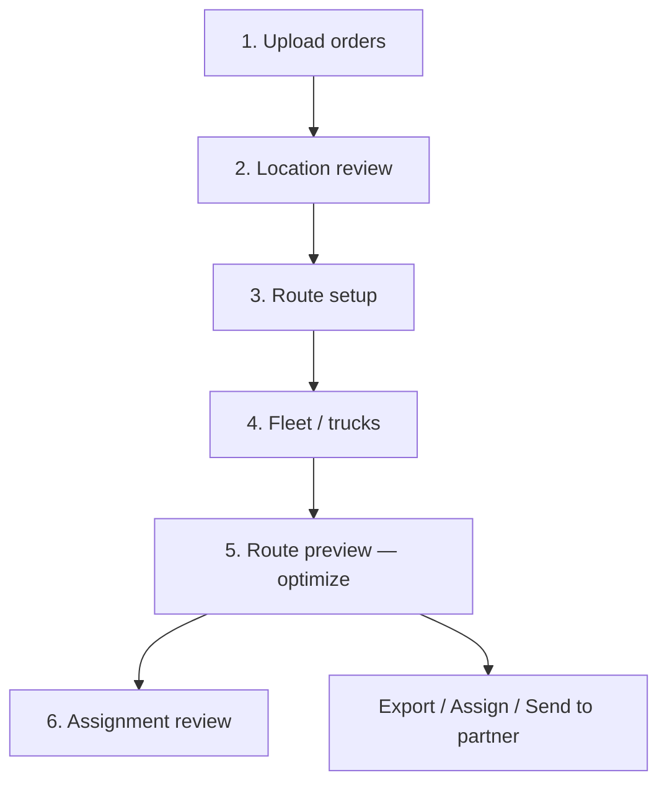

# Route Planning — end-to-end flow for beginners

This guide explains **Route Planning V2** in plain language: how to take a list of delivery orders and turn them into optimized truck routes you can export, send to a partner system, or **assign to TCMS Planner**.

No API or coding knowledge required for the main wizard path.

---

## What is Route Planning?

**Route Planning** is a step-by-step wizard in the TCMS Booking Web App. You:

1. Bring in **orders** (stops to visit).
2. Check **locations** on a map.
3. Set your **depot** (where trucks start) and **trucks**.
4. Let **HERE Maps** calculate the best routes.
5. **Export**, **assign to planner**, or **send to a third party**.
6. Do a final **assignment review** before drivers go out.
7. On delivery day, **monitor live progress** on the map (optional but recommended).

Each run is saved as a **planning session**. **Session history** (under **Usage metrics & history**) shows where you are in the workflow — for example **Optimized** after routes are calculated and **Planned in TCMS** after you assign drivers and trucks.

---

## Where to open it

1. Log in to the **TCMS Booking Web App** (often under a path like `/lightapp`).
2. In the sidebar, go to **Operations → Route planning**.
3. You land on **Upload orders** (`/lightapp/route-planning/upload`).

:::info Legacy page
An older **Route optimization** page may still exist at `/route-optimization`. Use **Route planning** for the full wizard described here.
:::

**Live monitoring:** After routes are optimized (and ideally assigned), open **Operations → Live Route Tracking** (`/lightapp/route-planning/live-tracking`) to see planned routes with live driver GPS, stop swipe/POD status, and driven-path replay. See [Live route tracking](./live-route-tracking).

---

## The big picture (6 steps)

| Step | What you do | Why it matters |
| :---: | :--- | :--- |
| **1. Upload** | Load orders from Excel/CSV (or they arrive via webhook from your ERP) | Creates a **session** and list of stops |
| **2. Locations** | Fix pins on the map; geocode bad addresses | HERE cannot route stops without usable coordinates |
| **3. Route setup** | Confirm depot, planning date, return-to-depot | Defines where routes **start and end** |
| **4. Fleet** | Choose trucks, capacities, shifts | HERE needs vehicles to split stops into tours |
| **5. Route preview** | Run optimization; view map and route list | This is the main “planning” screen |
| **6. Assignment** | Final check; assign to planner if not done yet | Hand-off before operations / drivers |

The step bar at the top of each screen lets you jump back to an earlier step (for example to fix a wrong pin).

---

## Two ways to get orders in

### Path A — Excel or CSV (most dispatchers)

Best when you prepare a file from WMS, ERP, or a spreadsheet.

1. On **Upload orders**, download the **template** if you need the column layout.
2. Fill in one row per stop (order number, address or lat/lng, service time, weight or volume — see [Required columns](#minimum-columns-in-your-upload-file)).
3. Drag the file onto the page or click to browse.
4. Click **Upload to server** (recommended when your IT team has enabled Route Planning on the server).
5. Click **Continue to location review**.

### Path B — Webhook from another system (IT / integration)

Best when orders are pushed automatically from ERP, OMS, or a custom integration.

- Your IT team sends JSON to the server webhook (see [Developer → Webhook order ingest](../developer/route-planning/webhook-orders-ingest-api)).
- You receive a **session id** (or find the session in **Session history**).
- Open **Route planning → Location review** and continue from step 2.

:::tip For dispatchers using webhooks
You usually **do not** call the webhook yourself. Ask IT to confirm orders were ingested, then open **Session history** and click **Open** on today’s session.
:::

---

## Step 1 — Upload orders

**Screen:** Upload orders

**Do this:**

1. Prepare your file (`.xlsx`, `.xls`, or `.csv`).
2. If stops have time windows like `08:00`–`17:00`, set **Planning date** and **Timezone** on the upload screen.
3. Upload to the **server** so the session is saved in the database.
4. Read the upload summary: how many rows were **accepted** vs **rejected**.
5. Fix rejected rows in your file and re-upload if needed.
6. Click **Continue to location review**.

**You should see:** A **session id** (UUID) on later screens — that is your planning run reference. Session history should show status **Ingested** after a successful upload.

### Minimum columns in your upload file

| Column | Required? | Notes |
| :--- | :---: | :--- |
| Order number (`orderNo`) | Yes | Unique per order |
| Address **or** lat + lng | Yes | Need one or the other |
| Service time (minutes) | Yes | Must be &gt; 0 |
| Weight (kg) **or** volume (m³) | Yes | At least one &gt; 0 |
| Customer name, phone, time windows | No | Helpful for drivers and load planning |

---

## Step 2 — Location review

**Screen:** Location review

**Do this:**

1. Scan the stop list and map — every stop that will be routed needs a **valid pin**.
2. For stops marked pending geocode:
   - Confirm the suggested address, **or**
   - Search / pick a point on the map, **or**
   - Enter lat/lng manually.
3. Mark depot/start location if your process uses “set start from stop”.
4. When the list looks correct, click **Continue** (to route setup or straight to fleet, depending on your flow).

**Do not continue** if many stops still have no coordinates — optimization will fail or skip them.

---

## Step 3 — Route setup

**Screen:** Route setup *(sometimes skipped when depot is already clear from location review)*

**Do this:**

1. Set or confirm the **depot** (warehouse / DC coordinates).
2. Choose **return to depot** (round trip) vs one-way if applicable.
3. Set route-level options your tenant uses (max stops per truck, etc.).
4. Continue to **Fleet / trucks**.

---

## Step 4 — Fleet / trucks

**Screen:** Fleet setup

**Do this:**

1. Add the trucks that will run today (from **API grid** = pull from TCMS truck master, or **manual** entry).
2. For each truck type, set:
   - **Capacity** (weight/volume),
   - **Max stops**,
   - **Shift / start time** (when HERE can begin routes).
3. Fix any validation warnings (red flags on rows).
4. Click **Continue to route preview**.

**Rule of thumb:** More trucks and shifts → more parallel routes. Too few trucks → unassigned stops after optimization.

---

## Step 5 — Route preview (optimization)

**Screen:** Route preview / Optimization review

This is where routes are **calculated** and shown on the map.

### What happens automatically

When stops, depot, fleet, and HERE configuration are ready, the app **runs optimization** (on the server and/or in the browser). Wait for:

- Route lines on the **map**
- **Optimized routes** list on the left
- Summary cards: vehicles used, assigned stops, distance, duration

When optimization finishes, **Session history** should show **Optimized** — whether the calculation ran on the server or in your browser (for example in a dev environment).

### What you can do on this screen

| Action | When to use it |
| :--- | :--- |
| **Re-run / Retry optimization** | You changed stops, excluded a stop, or added trucks |
| **Export route plan** | Download JSON of optimized routes |
| **Export load plan** | Download load/sequence JSON |
| **Plan with Driver & Truck** → **Assign to planner** | Create trips in TCMS Planner (pick truck + driver per route) |
| **Send to Third Party** | Send plan JSON to a partner HTTPS URL |
| **Continue to assignment** | Move to final review when routes look good |

:::info One button for planners
The modal always shows **Assign to planner**. You do not need to know whether routes were saved via server or browser optimization — the app handles that for you.
:::

### Unassigned stops

Stops that could not fit any truck appear in the **Unassigned** panel on the right. Typical fixes:

- Add another truck or shift in **Fleet setup** and re-run optimization.
- Remove or exclude problematic stops intentionally.
- Use truck suggestions if your tenant has that feature enabled.

### Status strip (top of wizard)

Expand **Route planning status** to see:

| Badge | Meaning |
| :--- | :--- |
| **Server V2** | Server optimize / assign / dispatch APIs enabled |
| **DB ok** | Database migrations applied |
| **HERE ok** | HERE API key configured on server |

If **Server off** but you still have a browser HERE key, optimization may still run in the browser for testing — session history should still advance to **Optimized** when routes succeed.

---

## Step 6 — Assignment review

**Screen:** Assignment review

**Do this:**

1. Review each route’s stop order, **delivery addresses**, and details.
2. Optionally generate and inspect a planner payload preview.
3. Click **Assign to planner** if you have not already done so on route preview.
4. After a successful assign, the session becomes **view-only** — you can still review routes and exports, but **Assign to planner** is disabled.

When you reopen a session that was already assigned, routes and stop addresses should still be visible.

---

## Step 7 — Live route tracking (delivery day)

**Screen:** Live Route Tracking (`/lightapp/route-planning/live-tracking`)

**When to use:** After **Assign to planner**, while drivers are executing routes on the selected **planning date**.

**Do this:**

1. Set the **planning date** to match the day you planned (defaults to today).
2. Review **summary stats** (on route / at risk / off route / no signal).
3. Select a route in the left list or on the map to open **driver**, **truck**, and **delivery stop** details.
4. Click stop markers to see **swipe in/out** and **POD** links.
5. Turn on **Driven path** and use **Route replay** to compare actual GPS vs the planned line.
6. Leave **Auto 30s** on for hands-free updates — the map keeps your zoom after you pan.

Full walkthrough: [Live route tracking](./live-route-tracking).

---

## After planning — optional actions

These happen from **Route preview** (step 5) or **Assignment review** (step 6) when status is **Optimized**:

### Assign to planner (“Plan with Driver & Truck”)

1. Open the modal — one row per optimized route.
2. Enter **own truck** or **vendor truck**, driver name, IC number, and tonnage.
3. Click **Assign to planner**.

Session history moves to **Planned in TCMS** (`COMMITTED` in the database). You **cannot assign twice** for the same session — the button is disabled and a banner explains the session is view-only.

### Send to third party

Sends route and/or load plan JSON to a **HTTPS webhook URL** your partner provides (configured at send time in the modal).

### Export only

Download JSON files without assigning — useful for archiving or manual import elsewhere.

---

## Finding old sessions

1. On any route planning screen, click **Usage metrics & history** (top bar).
2. Open the **Session history** tab.
3. Filter by date or status.
4. Click **Open** to resume that session at the right wizard step.

Statuses you should see after a full successful run:

| Status in history | Meaning |
| :--- | :--- |
| **Ingested** | File uploaded or webhook received |
| **Optimizing** | Calculation in progress (brief) |
| **Optimized** | Routes calculated — ready to export or assign |
| **Planned in TCMS** | Assigned to planner — view-only |

For **failed** optimization or dispatch only, use the **Failed sessions** tab (with **Retry** where available).

---

## Session statuses (simple meanings)

| Status | What it means for you |
| :--- | :--- |
| **Ingested** | Orders loaded; finish locations and fleet |
| **Ready to optimize** | Ready for HERE run |
| **Optimizing** | Calculation in progress — wait |
| **Optimized** | Routes ready — export, assign, or continue |
| **Optimization failed** | Fix inputs or retry from banner / Failed sessions |
| **Planned in TCMS** | Already assigned to planner — session is view-only |

:::tip Session history stuck on Ingested?
If you completed optimize and assign but history still shows **Ingested**, ask IT to deploy the latest Booking Web App build. Current versions sync session status after browser optimization and after **Assign to planner**.
:::

---

## Common problems (quick fixes)

| Problem | What to try |
| :--- | :--- |
| Upload fails / “table doesn’t exist” | Ask IT to run route-planning **database migrations** |
| Map empty on route preview | Complete **location review**; ensure depot + fleet are set; wait for optimization to finish |
| All stops unassigned | Add trucks/shifts or increase max stops; re-run optimization |
| **Server off** in status strip | Ask IT to enable `routePlanningV2Enabled` and redeploy backend |
| **HERE ok** missing | Ask IT to set `HERE_API_KEY` on the server |
| Webhook orders not appearing | IT checks webhook secret, tenant id, and **Session history** |
| Duplicate webhook error (409) | Normal on retry — use a **new** idempotency key for new batches |
| Session history stuck at **Ingested** after optimize | Update to latest Booking Web App; check network for errors when saving session status |
| **Assign to planner** disabled | Session may already be **Planned in TCMS** — review only |

---

## Who does what (roles)

| Role | Typical tasks |
| :--- | :--- |
| **Dispatcher** | Upload file, fix locations, fleet, review routes, assign/export |
| **IT / integration** | Webhook setup, secrets, migrations, HERE key, feature flags |
| **Operations manager** | Usage metrics, session history, failed session retries |

---

## Related documentation

| Document | Audience |
| :--- | :--- |
| [Live route tracking](./live-route-tracking) | Dispatchers — GPS map, stops, swipe/POD on delivery day |
| [Webhook order ingest (API)](../developer/route-planning/webhook-orders-ingest-api) | Developers integrating ERP/webhook |
| [Postman webhook demo](/postman/Route-Planning-Webhook-Demo.postman_collection.json) | Import into Postman — 3 signed sample ingests |
| [Session lifecycle & status sync](../developer/route-planning/session-lifecycle) | Developers — status transitions and assign paths |
| [Error codes](../developer/route-planning/error-codes) | Developers — `RP_*` API errors |
| [Route Planning developer intro](../developer/route-planning/intro) | API base path and technical overview |

---

## Quick checklist — “Did I do everything?”

Before you tell drivers to go:

- [ ] Every routed stop has coordinates on the map  
- [ ] Depot and fleet are configured  
- [ ] Optimization completed (routes visible, not placeholder cards)  
- [ ] Session history shows **Optimized** (or later)  
- [ ] Unassigned stops are intentional or resolved  
- [ ] Export / assign / partner send completed if required by your process  
- [ ] Assignment review done  
- [ ] Session history shows **Planned in TCMS** if trips were created in Planner  
- [ ] **Live Route Tracking** checked on delivery day (GPS, stops, POD) if your process requires it  

That is the full end-to-end flow.
