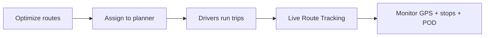

# Live route tracking

After routes are **optimized** and (optionally) **assigned to planner**, dispatchers can monitor planned routes on a map with **live driver GPS**, **stop-level progress** (swipe in/out, POD), and **driven-path analysis** for the selected day.

No coding required — this screen is part of the Route Planning module in the TCMS Booking Web App.

---

## Where to open it

1. Log in to the **TCMS Booking Web App** (Light App), e.g. `https://{host}/lightapp`.
2. In the sidebar: **Operations → Live Route Tracking**.
3. Direct URL: `/lightapp/route-planning/live-tracking` (or `/route-planning/live-tracking` depending on your app base path).

:::info Prerequisite
Live tracking shows sessions that reached **Optimized**, **Planned in TCMS** (`COMMITTED`), or **Exported** for the **planning date** you select. Run the planning wizard first (see [End-to-end flow](./end-to-end-flow)).
:::

---

## What you see

| Area | Purpose |
| :--- | :--- |
| **Top toolbar** | Planning date, manual refresh, **Driven path** toggle, **Auto 30s** refresh, link back to Route planning upload |
| **Summary stats** | Count of routes and drivers: on route, at risk, off route, no signal — closable |
| **Planned routes** (left) | List of optimized routes for the date; click a route to select it — closable |
| **Map** | Planned polylines, numbered stop markers (colour = operational status), live driver markers |
| **Selected route** (right) | Driver, truck, trip, tracking status, delivery stops with swipe/POD — closable |
| **Route replay** (bottom) | Timeline scrubber for GPS history of the selected route — closable |
| **Legend** (bottom) | Map colour key — closable |

All panels except the **top toolbar** can be closed and reopened with small pills (**Stats**, **Routes**, **Details**, **Replay**, **Legend**).

---

## Planning date

Use the **date picker** in the top toolbar. It defaults to **today** and filters route-planning sessions whose **planning date** matches that day (with a fallback for sessions that have no planning date but were updated that day).

Change the date to review another day’s optimized routes.

---

## Summary stats

| Badge | Meaning |
| :--- | :--- |
| **Routes** | Total optimized routes shown for the date |
| **On route** | Driver GPS is within ~150 m of the planned path |
| **At risk** | Driver is 150–500 m from the planned path |
| **Off route** | Driver is more than ~500 m from the planned path |
| **No signal** | No recent GPS for that route’s booking / truck / driver |

These counts update when you refresh (manually or every 30 seconds if **Auto 30s** is checked).

---

## Working with routes and stops

### Select a route

- Click a route in the **Planned routes** list, **or**
- Click a route **polyline** on the map.

The **Selected route** panel opens with driver, truck, load summary, and all delivery stops.

### Select a stop

- Click a **numbered stop marker** on the map, **or**
- Click a stop row in the left list (when the route is expanded) or in the **Selected route** panel.

Stop markers are coloured by operational status:

| Colour / status | Meaning |
| :--- | :--- |
| **Pending** | No swipe in yet |
| **Arrived** | Driver swiped in at the delivery |
| **Departed** | Driver swiped out |
| **Done** | Delivered and/or POD uploaded |

The selected stop shows **swipe in / swipe out** times and **proof documents** (POD image links when uploaded).

### Driver marker

The **D** marker shows the latest GPS position for that route. Colour matches tracking status (on route / at risk / off route / no signal).

---

## Driven path and replay

When a route is selected:

1. Enable **Driven path** in the top toolbar to draw the truck’s actual GPS trail for that day.
2. **On-plan** segments appear in amber; **off-route** segments in red.
3. Open **Route replay** to scrub through GPS points and see deviation at each timestamp.

Replay requires GPS history linked to the route’s bookings (mobile tracking active after assign to planner).

---

## Auto refresh

With **Auto 30s** enabled, the app reloads live routes and driver positions every 30 seconds **without reloading the map tiles** or changing your zoom/pan after you have moved the map.

Use **Refresh** for an immediate update.

---

## Map behaviour

- **First load** — map zooms to fit all visible routes.
- **After you pan or zoom** — the viewport stays where you left it on refresh.
- **New planning date** — map fits once to the new day’s routes.

---

## Common problems

| Problem | What to try |
| :--- | :--- |
| No routes for the date | Confirm session history shows **Optimized** or **Planned in TCMS** for that planning date |
| Only one route when history shows more | Some sessions may have routes only in optimization JSON — re-run optimize and assign so `route_planning_route` rows exist |
| **No signal** for all routes | Trips not created in Planner yet, or mobile GPS not reporting |
| Stop always **Pending** | Booking not linked on stop, or delivery row not matched — IT checks `booking_id` on stops and `order_deliveryaddress` |
| Swipe times empty | Driver has not swiped in/out on the TCMS mobile app for that delivery |
| POD links missing | No POD uploaded in `podmanager` for that delivery |
| Driven path empty | No GPS history for that booking on the selected date |

---

## After planning — typical dispatcher flow

1. Complete [End-to-end flow](./end-to-end-flow) through **Assign to planner**.
2. On delivery day, open **Live Route Tracking** for the same **planning date**.
3. Monitor progress; drill into stops for swipe and POD status.

---

## Related documentation

| Document | Audience |
| :--- | :--- |
| [End-to-end flow](./end-to-end-flow) | Planning wizard before live tracking |
| [Live route tracking API](../developer/route-planning/live-route-tracking-api) | Developers — REST endpoints and JSON fields |
| [Session lifecycle](../developer/route-planning/session-lifecycle) | Which session statuses appear on the live map |
