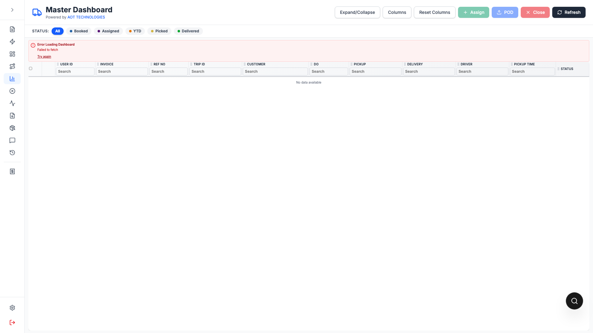
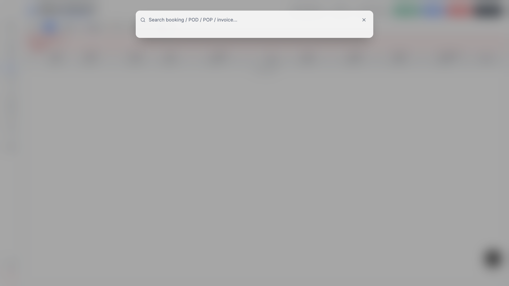
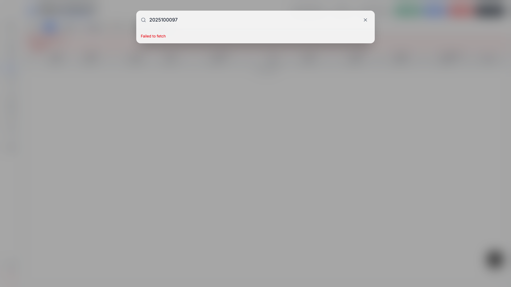

# Global Floating Search

This page explains how to use the floating global search icon and spotlight-style modal.

## Screenshots

Floating icon:

Spotlight modal:

Results and actions list:

> Note: This capture was taken in a local dev session; API connectivity in that run returned `Failed to fetch`, but the UI states and interaction flow are shown.

## What it is

Global Floating Search is a draggable quick-access search button available on logged-in pages.

When clicked, it opens a spotlight-style modal with blur background and global lookup results.

## How to use

1. Drag the floating icon to any screen position.
2. Click the icon to open search.
3. Type at least **3 characters** (booking id, Job ID, POD id, POP id, invoice id).
4. Click a result to navigate.

## Position memory

- The floating icon position is saved in cookies.
- On next visit/login, it appears at the same saved location.

### Minimum query length

- API search starts only when the input has **3 or more characters**.
- For 1-2 characters, no API call is made and UI prompts the user to type more.

## Result actions

- **Booking ID(JOB ID)** click:
  - Opens edit booking page: `/booking/{bookingId}`

- **POD ID** click:
  - Redirects to `/do-search`
  - Auto-fills DO filter
  - Auto-runs search

- **POP ID** click:
  - Redirects to `/co-search`
  - Auto-fills CO filter
  - Auto-runs search

- **Invoice**:
  - Display only (no click action currently)

## Keyboard

- Press `Esc` to close the search modal.

