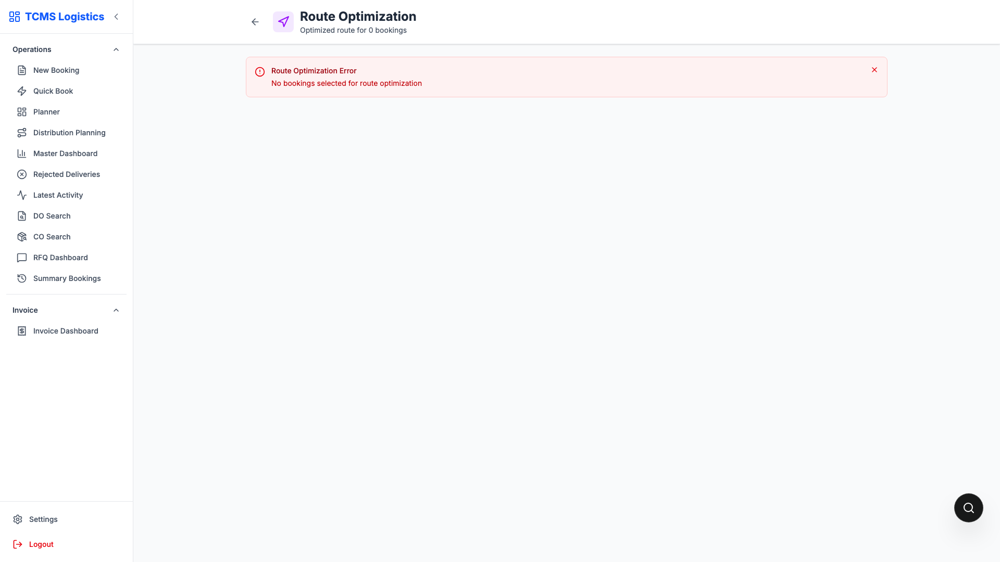

# Master Dashboard Assign Flow

This page explains the new Assign button behavior in Master Dashboard.

## Screenshots

Assign button placement in Master Dashboard:

Multi-select planning route (Route Optimization page):

> Note: A dedicated single-row quick-assign modal screenshot is still pending from a data-connected session.

## Button position

The **Assign** button is placed before **POD** in the action bar.

## Selection rules

### Case 1: Single booked row selected

- Opens quick assign modal
- User selects truck and driver
- Assignment is submitted directly

### Case 2: More than one booked row selected

- Opens planning flow in Route Optimization
- Redirects to `/route-optimization`
- Selected bookings are passed to planning state

### Case 3: Any selected row is not Booked

- Action is blocked
- Validation message shown

## Why this helps

- Fast assign for one booking
- Batch planning for multiple bookings
- Prevents invalid assign actions by status

