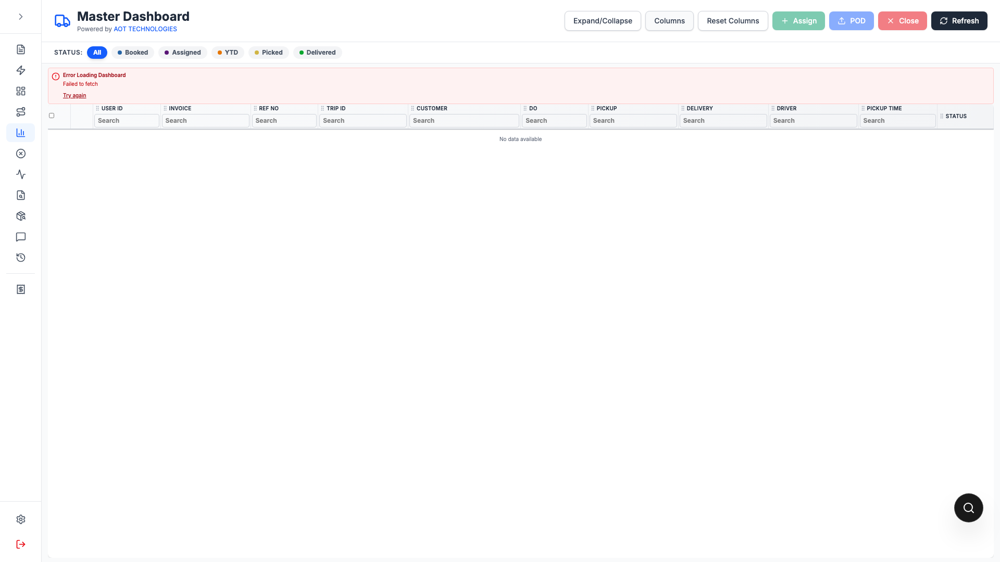

# Preferences Storage and Save API

This page documents how UI preferences are loaded, stored, and saved.

## Screenshot

Example of persisted table preference outcome (custom columns retained):



## Login preference load

On login, if backend response includes:

- `result.preferences`

it is saved into local storage:

- `localStorage.setItem("preferences", result.preferences)`

## Preference key strategy

Preferences use table keys defined in:

- `src/config/tablePreferenceKeys.js`

Example key:

- `tables.masterDashboard`

This key maps to table-specific settings in the global JSON.

## Local preference read/write

Utility:

- `src/utils/preferencesStorage.js`

Capabilities:

- Read entire preferences JSON from `localStorage.preferences`
- Read table-level settings by key path
- Update table-level settings by key path

## Backend save endpoint

API helper:

- `savePreferences(preferencesString)` in `src/utils/api.js`

Calls:

- `POST /rest/tmslogin/savePreferences`

Request body:

```json
{
  "userId": "EMP00015",
  "preferences": "{\"tables\":{\"masterDashboard\":{...}}}",
  "authKey": "..."
}
```

## Master Dashboard saved fields

For `tables.masterDashboard`, current persisted fields:

- `columnOrder`
- `visibleColumnIds`

## Save trigger

Preferences are saved when user changes:

- column order
- visible columns

Save is debounced to reduce API calls.

